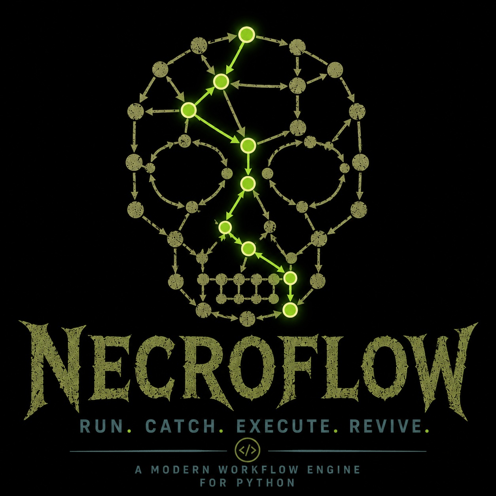

[](https://github.com/MatteoLacki/necroflow/actions/workflows/ci.yml)
[](https://pypi.org/project/necroflow/)
[](https://www.python.org/)
[](LICENSE)

# necroflow

<p align="center"></p>

Python pipeline framework inspired by Snakemake. Define rules, wire them into pipelines, run with automatic parallelism and caching.

A local browser GUI for visualising pipelines and launching runs is available at [necroflow_gui](https://github.com/MatteoLacki/necroflow_gui).

See [COMPARISON.md](COMPARISON.md) for a detailed comparison with Snakemake, Nextflow, Luigi, CWL/WDL, and Prefect/Airflow across 20 axes.

## Core ideas

- **Rules** describe how to produce outputs from inputs — shell command templates with typed I/O.
- **Pipelines** wire rule calls together for a single config.
- **DAG** runs many pipelines at once, deduplicating shared upstream work across samples automatically.
- **Paths** are derived from a content-addressed hash of the full input chain — same inputs always produce the same path, different inputs produce different paths. The filesystem is the cache.

## Install

```bash
cd necroflow
make venv
source .venv/bin/activate
```

## Quick example

```python
from necroflow import NodeType, Rules, Pipeline, DAG

# 1. Define types
class Fastq(NodeType):
    """Raw sequencing reads."""
    filename = "reads.fastq.gz"

class Bam(NodeType):
    """Aligned reads."""
    filename = "aligned.bam"

class Counts(NodeType):
    """Per-gene read counts."""
    filename = "counts.txt"

# 2. Register rules
r = Rules()

@r.command("ln -s {path} {fastq}")
def raw_fastq(path: str):
    """Symlink a raw FASTQ file into the output tree."""
    return Fastq[fastq]

@r.command("bwa mem {ref} {fastq} > {bam}", threads=4)
def align(fastq: Fastq, ref: str):
    """Align reads to a reference genome with BWA-MEM."""
    return Bam[bam]

@r.command("featureCounts -a {gene_model} {bam} -o {counts}")
def count(bam: Bam, gene_model: str):
    """Count reads per gene using featureCounts."""
    return Counts[counts]

# 3. Build a pipeline
def rna_pipeline(config, r):
    P = Pipeline()
    P.fastq = r.raw_fastq(path=config.path)
    P.bam = r.align(P.fastq, ref=config.ref)
    P.counts = r.count(P.bam, gene_model=config.gene_model)
    return P
```

The original `R.register(...)` API continues to work unchanged.

## Running one sample

`DAG("results")` sets the output directory where all computed files will be written (you can use any path you like).

```python
from types import SimpleNamespace

config = SimpleNamespace(path="/data/s1.fastq.gz", ref="hg38", gene_model="gencode_v44")
dag = DAG("results")           # output directory — change to any writable path
dag.add(rna_pipeline(config, R))
dag.execute()
```

## Running many samples

```python
configs = [
    SimpleNamespace(path="/data/s1.fastq.gz", ref="hg38", gene_model="gencode_v44"),
    SimpleNamespace(path="/data/s2.fastq.gz", ref="hg38", gene_model="gencode_v44"),
    SimpleNamespace(path="/data/s3.fastq.gz", ref="hg38", gene_model="gencode_v44"),
]

dag = DAG("results")
for config in configs:
    dag.add(rna_pipeline(config, R))

dag.execute()   # runs all samples in parallel, skips any already-computed outputs
```

Nodes with identical upstream configs (e.g. a shared reference index) are deduplicated across samples — recognised by hash, run once.

## Conditional pipelines

Pipeline factory functions are plain Python, so `if/else` branching on config values works naturally:

```python
def my_pipeline(config, R):
    P = Pipeline()
    P.a = R.align(path=config.path, ref=config.ref)
    if config.call_variants:
        P.result = R.call_snps(P.a)
    else:
        P.result = R.count_reads(P.a)
    return P
```

The branching config value (`config.call_variants`) does not need to be passed to any node. The rule name already encodes which branch was taken in the fingerprint, so `call_snps` and `count_reads` always produce distinct output paths regardless.

Two pipelines sharing the same upstream config (e.g. same `path` and `ref`) will reuse the `align` output — recognised as a cache hit — even if they take different branches downstream.

**Pipeline attribute names cannot be overwritten.** Assigning to the same name twice raises `ValueError`. If you want to build a pipeline in a loop, use distinct names:

```python
for i, step in enumerate(steps):
    setattr(P, f"result_{i}", R.process(step_node, mode=step))
```

The idiomatic pattern for multi-sample or multi-condition work is separate `Pipeline` objects added to a shared `DAG` — one pipeline per config, one `dag.add(P)` call per pipeline.

## Inspecting a pipeline

```python
from necroflow import resolve_command

P = rna_pipeline(config, R)
print(P)                    # layered ASCII DAG to stdout
P.save("pipeline.txt")      # same render to a file

dag.save("dag.txt")         # works on DAG too

P.resolve_paths("results")
for node in P.nodes:
    print(resolve_command(node))   # fully-resolved shell command
```

## Caching

Each output lives at `outdir/{rule}/{hash16}/{filename}`. The 16-character hash captures the entire upstream config chain, including rule name, command, config values, parent fingerprints, and declared `Inputs`/`Outputs` types (`Constraints` are excluded — execution resources don't affect output identity).

- Re-running with the same inputs is a no-op (cache hit).
- Changing any upstream parameter, command, or declared type produces a new path — old results are never overwritten.
- A parent whose mtime is newer than a child triggers a content-hash check: if the parent's bytes are unchanged, the child is **not** re-run. Only a genuine content change marks children STALE.
- Each output folder contains a `.rip/` subdirectory with:
  - `dependencies.toml` — full accumulated config for provenance.
  - `{filename}.hash` — SHA-256 content hash, used for STALE detection on the next run.
  - `job.log` — captured stdout/stderr.
  - `state` — last recorded run state (`running` / `up_to_date` / `failed` / `interrupted`). If a process is killed mid-run the `state` file is left as `running`; on the next invocation necroflow detects this and re-runs the node even if its output exists on disk.

## Concurrency

**Only one necroflow instance may run against a given `outdir` at a time.** `execute()` acquires an exclusive lock on `outdir/.rip/necroflow.lock` (via `fcntl.flock`) at startup and releases it on exit. A second instance targeting the same outdir will fail immediately with a clear error. Running two instances against *overlapping* outdirs (e.g. `results` and `results/sub`) is unsupported — there is no OS primitive to detect this, so avoid it.

## Parallelism and scheduling

`execute()` runs nodes in parallel subject to resource caps. By default the thread cap is all available CPUs. Declare per-job requirements with `Constraints`; set global caps via `resource_caps` (Python API) or CLI flags.

```python
@r.command("bwa mem {ref} {fastq} > {bam}", threads=4, ram="8Gi")
def align(fastq: Fastq, ref: str):
    """Align reads with BWA-MEM."""
    return Bam[bam]

dag.execute(resource_caps={"threads": 16, "ram": parse_resource("64Gi")})
```

Resource values accept SI (`K M G T P` = powers of 1000) and binary (`Ki Mi Gi Ti Pi` = powers of 1024) suffixes — e.g. `"8Gi"` is 8 GiB, `"8G"` is 8 GB. A job whose requirement exceeds the cap still runs solo when nothing else is running.

By default the scheduler prioritises nodes from the **smallest connected component** of remaining work — this tends to finish whole samples before starting new ones, keeping memory pressure low.

```python
from necroflow import fifo_scheduler

dag.execute(resource_caps={"threads": 16}, scheduler=fifo_scheduler)  # topological order instead
```

Custom schedulers:

```python
def my_scheduler(ready, remaining):
    return sorted(ready, key=lambda n: n.rule.constraints.get("threads", 1), reverse=True)

dag.execute(scheduler=my_scheduler)
```

## Types and subtypes

NodeTypes form an inheritance hierarchy — a rule accepting `Bam` also accepts `SortedBam`:

```python
class SortedBam(Bam):
    """Coordinate-sorted BAM."""
    filename = "sorted.bam"

@r.command("samtools sort {bam} -o {sorted_bam}")
def sort(bam: Bam):
    """Sort BAM by coordinate with samtools."""
    return SortedBam[sorted_bam]

@r.command("featureCounts -a {gene_model} {bam} -o {counts}")
def quantify(bam: SortedBam, gene_model: str):  # only accepts sorted bam
    """Count reads per gene using featureCounts."""
    return Counts[counts]
```

## Failure handling

```python
dag.execute(keep_going=True)   # continue independent branches past failures
```

With `keep_going=False` (default) the first failure raises immediately. With `keep_going=True` independent branches keep running and all failures are collected into an `ExceptionGroup` at the end.

After each successful job, necroflow verifies that the declared output file exists. A command that exits 0 but writes no output is treated as a failure.

Run state is persisted to a plain-text `state` file inside each node's `.rip/` directory between invocations. A node whose output exists on disk but whose previous run was interrupted by a signal or left in an unknown state is automatically re-executed next time.

Each job's stdout/stderr is captured to `outdir/{rule}/{hash}/.rip/job.log`. On failure the log is printed to the terminal.

## Multi-output rules

A rule with multiple declared outputs runs its command **once**; all co-outputs are marked complete when the command finishes:

```python
@r.command("bwa mem {ref} {fastq} > {bam} 2> {log}", threads=4)
def align(fastq: Fastq, ref: str):
    """Align reads with BWA-MEM, capturing the log."""
    return Bam[bam], Log[log]

P = Pipeline()
P.fastq = R.raw_fastq(path=config.path)
P.bam, P.log = R.align(P.fastq, ref="hg38")
```

## Cleaning orphan outputs

Outputs that existed from a previous run but are no longer in the required subgraph are classified as `ORPHAN`. Pass `autoclean=True` to delete them per-file (files via `unlink`, directories via `rmtree`):

```python
dag.execute(autoclean=True)
```

Or via CLI:

```bash
necroflow --outdir results --autoclean job.toml   # job.toml contains ".pipeline" key
```

## Command-line interface

necroflow ships a `necroflow` command. Each positional argument is a **job TOML** — a self-contained file that specifies the pipeline factory, optional requested outputs, and user config params.

```bash
necroflow --outdir results [-c N|all] [--constraint KEY=VALUE ...] \
          [--keep-going] [--autoclean] [--dry-run] JOB.toml [JOB2.toml ...]
```

| Flag | Meaning |
|---|---|
| `-c N` / `-call` | Thread cap — integer or `all` (default: all CPUs). |
| `--constraint KEY=VALUE` | Additional resource cap. Repeatable. Accepts SI/binary suffixes. |
| `--keep-going` / `-k` | Continue past failures; collect all errors at the end. |
| `--autoclean` | Delete orphan and intermediate outputs. |
| `--dry-run` / `-n` | Show what would run without executing. |

```bash
necroflow --outdir results -c8 --constraint ram=64Gi job.toml
```

### Job TOML format

```toml
# required — path resolved from the directory where necroflow is invoked
".pipeline" = "path/to/factory.py:function_name"

# optional — pipeline_label names to request (defaults to all sinks)
".requests" = ["counts", "qc"]

# user config — passed as a plain dict to the factory
ref    = "hg38"
sample = "NA12878"
```

Keys starting with `.` are necroflow metadata — stripped before the dict reaches the factory. They never appear in node configs or affect output hashes. User config can freely use any name, including `pipeline` or `request`.

### Parameter grids

Any TOML key ending in `__grid` is expanded into a Cartesian product of all
combinations. The resulting output subfolders use the same naming scheme as
[snakemakeconfigs](https://github.com/MatteoLacki/snakemakeconfigs).

```toml
".pipeline"   = "factory.py:factory"
ref__grid     = ["hg38", "mm10"]
aligner__grid = ["bwa", "bowtie2"]
```

This produces four pipelines: `experiment__ref+hg38__aligner+bwa`,
`experiment__ref+hg38__aligner+bowtie2`, etc. Grid expansion also applies to
`pipeline` itself, so a single job TOML can fan out across different factory functions.

### Linked outputs

After every run the CLI creates one subfolder per grid combo under `outdir/`:

```
results/
  {rule}/{hash16}/{file}           ← real outputs (content-addressed)
  experiment__ref+hg38__aligner+bwa/
    {rule}/{hash16}/{file}         ← symlinks to requested outputs only
    manifest.toml                  ← requested output paths for this combo
  experiment__ref+hg38__aligner+bowtie2/
    ...
```

Only the **requested** outputs (defaults to pipeline sinks) get a symlink — intermediate ancestors are excluded. `manifest.toml` lists the same outputs keyed by the Pipeline attribute name assigned in the factory:

```toml
[outputs]
counts = "count/a3f1bc92/counts.txt"
```

The key (`counts`) matches `P.counts = R.count(...)` in the factory function.

See `examples/necroalchemy_grid.toml` and `examples/necroalchemy_factory.py`
for a runnable example.

## What is not yet implemented

- Cluster / cloud backends
