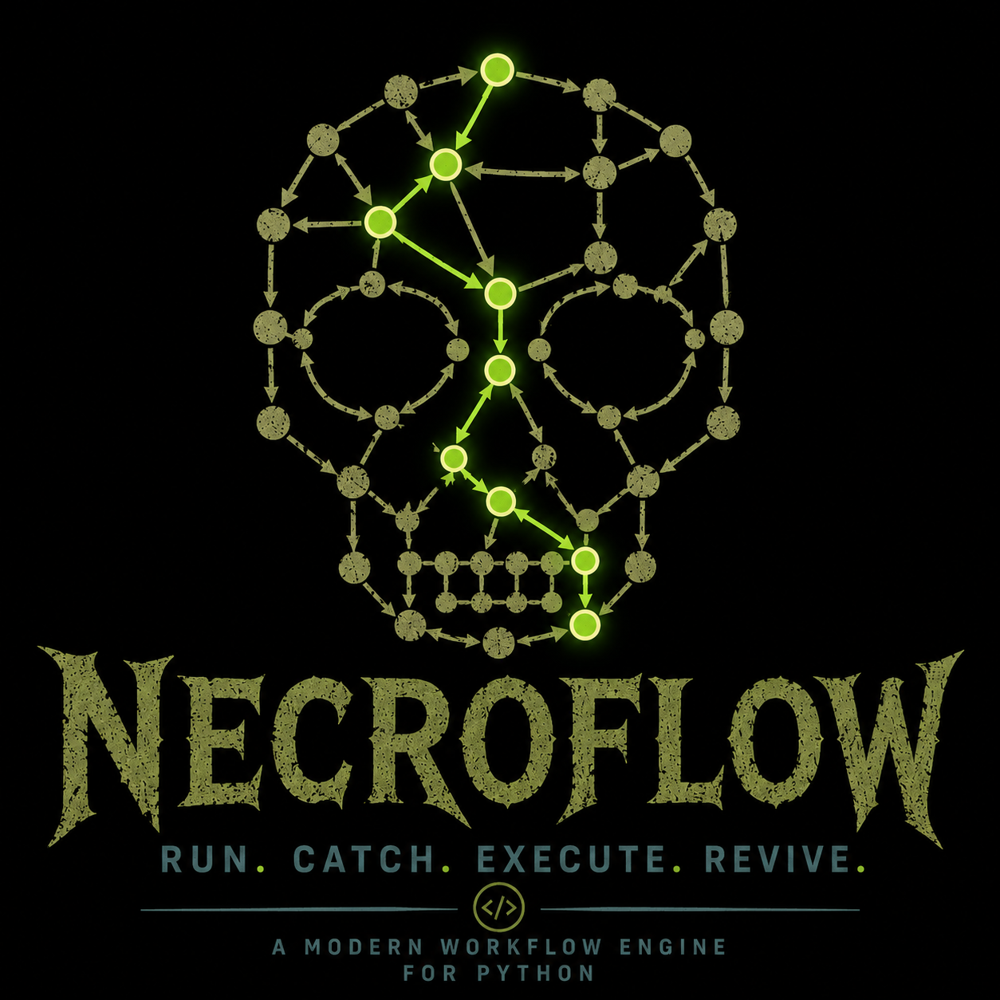

[](https://github.com/MatteoLacki/necroflow/actions/workflows/ci.yml)
[](https://github.com/MatteoLacki/necroflow/actions/workflows/ci.yml)
[](https://github.com/MatteoLacki/necroflow/actions/workflows/ci.yml)
[](https://pypi.org/project/necroflow/)
[](https://doi.org/10.5281/zenodo.21371562)
[](https://www.python.org/)
[](LICENSE)

# necroflow

<p align="center"></p>

Python pipeline framework inspired by Snakemake. Define rules, wire them into pipelines, run with automatic parallelism and caching. All in Python. All safe. All readable.

For a compact overview of the current software surface, see [features.txt](features.txt).

A local browser GUI for visualising pipelines and launching runs is available at [necroflow_gui](https://github.com/MatteoLacki/necroflow_gui).

See [COMPARISON.md](COMPARISON.md) for a detailed comparison with Snakemake, Nextflow, Luigi, CWL/WDL, and Prefect/Airflow across 20 axes.

## Core ideas

- **Rules** describe how to produce outputs from inputs — shell command templates with typed I/O and lint-clean `name = output(NodeType)` declarations.
- **Pipelines** wire rule calls together for a single config; prefixed subpipeline views make reusable loop-generated outputs requestable.
- **DAG** runs many pipelines at once, deduplicating shared upstream work across samples automatically.
- **Paths** are derived from a lineage-derived fingerprint of the full input chain — same inputs always produce the same path, different inputs produce different paths. The filesystem is the cache.

## Install

```bash
cd necroflow
make venv
source .venv/bin/activate
```

## Platform support

necroflow supports POSIX systems (Linux and macOS). We do not offer native Windows support because POSIX commands are the reproducible execution target for workflows. On Windows, use [Windows Subsystem for Linux (WSL)](https://learn.microsoft.com/windows/wsl/) to run necroflow in a POSIX environment.

## Reusable subpipelines

`P.subpipeline(prefix)` returns a view over the same Pipeline. Assignments through the view are registered on the root with the prefix, while rule identity and DAG deduplication remain unchanged:

```python
def sample_pipeline(P: Pipeline, reference, sample: dict) -> None:
    P.fastq = raw_fastq(P, path=sample["reads"])
    P.bam = align(P, P.fastq, reference)
    P.counts = count(P, P.bam)

def cohort_pipeline(P: Pipeline, config: dict) -> None:
    P.reference = prepare_reference(P, path=config["reference"])
    for sample in config["samples"]:
        sample_pipeline(
            P.subpipeline(f"samples/{sample['name']}"),
            P.reference,
            sample,
        )
```

The resulting labels include `samples/A/bam` and `samples/A/counts`. Prefixes are request/result names only and never enter fingerprints. The CLI calls `P.finish()` after a successful factory return. Direct Python callers must finish the root before selecting `P.sinks()`; finishing freezes the root and every subpipeline view.

## Define a pipeline

A command-line run points at a Python pipeline factory. Rules describe typed outputs and shell commands; the factory wires rule calls into a pipeline.

```python
# pipeline.py
from necroflow import DAG, NodeType, Pipeline, command, symlink_file, output

class Fastq(NodeType):
    filename = "reads.fastq.gz"

class Bam(NodeType):
    filename = "aligned.bam"

class Counts(NodeType):
    filename = "counts.txt"
@symlink_file
def raw_fastq(path: str):
    fastq = output(Fastq)
    return fastq
@command("bwa mem {ref} {fastq} > {bam}", threads=4)
def align(fastq: Fastq, ref: str):
    bam = output(Bam)
    return bam
@command("featureCounts -a {gene_model} {bam} -o {counts}")
def count(bam: Bam, gene_model: str):
    counts = output(Counts)
    return counts
def rna_pipeline(P: Pipeline, config: dict) -> None:
    P.fastq = raw_fastq(P, path=config["path"])
    P.bam = align(P, P.fastq, ref=config["ref"])
    P.counts = count(P, P.bam, gene_model=config["gene_model"])
```

## Compose pipeline fragments

A command-line pipeline factory receives a `Pipeline` view of the shared DAG and mutates it:
`factory(P, config) -> None`. The CLI creates one DAG with the node-store path,
then creates `P` with that DAG, the fingerprint policy, and shell context before
calling the factory. Consequently,
every rule call receives `P` first and returns Nodes whose absolute paths and
fingerprints are already final and already interned in the DAG.

For reusable internal fragments, pass an existing pipeline to a helper that
adds its named nodes. This lets several fragments contribute to one public
factory without changing the CLI factory signature:

```python
def add_alignment(P, config):
    P.fastq = raw_fastq(P, path=config["path"])
    P.bam = align(P, P.fastq, ref=config["ref"])

def rna_pipeline(P, config):
    add_alignment(P, config)
    P.counts = count(P, P.bam, gene_model=config["gene_model"])
```

An assembler mutates the supplied pipeline, so its labels must not conflict
with labels added by another fragment. Use this form for components that belong
to one pipeline. The caller creates a fresh `Pipeline(dag)` for each independent
config. Equivalent upstream calls are canonicalized immediately in the shared
DAG; after each factory, the caller marks its sinks or explicit outputs with
`dag.require(...)`.

Attribute and item labels share one namespace. Use `P.counts` for ordinary
Python identifiers and item syntax for generated paths:

```python
for dataset, config in combinations:
    P[f"{dataset}/{config}"] = count(P, inputs[dataset], config=config)
```

Labels are canonical relative POSIX paths, so `P["dataset/config"]` creates a
nested result at `results/<job>/dataset/config/<filename>` and is requested
with the same string in `.requests`. Absolute paths, empty or dot-prefixed
components, `.`, `..`, repeated/trailing separators, and paths exceeding Linux
`NAME_MAX`/`PATH_MAX` byte limits are rejected at assignment. Labels that collide
with Pipeline API attributes such as `nodes` are item-only.

## Run from the CLI

Create a job TOML that references the factory and carries the concrete parameters for one run.

```toml
# job.toml
".pipeline" = "pipeline.py:rna_pipeline" # from pipeline import rna_pipeline

path = "/data/s1.fastq.gz"
ref = "hg38"
gene_model = "gencode_v44"
```

Run it with the `necroflow` command:

```bash
necroflow job.toml
```

By default, real cached node outputs go under `nodes/`, while user-facing results and `manifest.toml` go under `results/`; above, simply `results/job`. Use explicit roots when you want them elsewhere:

```bash
necroflow --nodes-dir nodes --results-dir results job.toml
```

For many runs, use multiple job TOMLs or `__grid` values inside one job TOML:

```toml
".pipeline" = "pipeline.py:rna_pipeline"

path__grid = ["/data/s1.fastq.gz", "/data/s2.fastq.gz"]
ref = "hg38"
gene_model = "gencode_v44"
```

The same pipeline can also be assembled and executed from Python directly; see [Rules and typed outputs](docs/rules.md) and [Execution, scheduling, and cleanup](docs/execution.md). See [Command-line interface](docs/cli.md) and [Job TOML and parameter grids](docs/job-toml.md) for the full CLI format.

## Where outputs live

`DAG("some-dir")` writes real lineage-addressed node outputs directly under that directory. The CLI defaults to a split layout: canonical cached outputs under `nodes/`, plus per-job copies and `manifest.toml` files under `results/`. Linux and macOS opportunistically use filesystem copy-on-write cloning, so only requested outputs can require additional physical storage. See [Where outputs live and caching](docs/caching.md) for the full layout.


## Manual

Start with the canonical workflow in [examples/canonical](examples/canonical/),
or copy it with `necroflow init my-workflow`.

### CLI subcommands

The default command form is kept for convenience, but the same run can be written explicitly:

```bash
necroflow run job.toml
```

This executes the requested pipeline and creates cached outputs under `nodes/` plus job-facing copies and a manifest under `results/job/`.

Create a starter workflow from the canonical template:

```bash
necroflow init my-workflow
```

Example output:

```text
created my-workflow
```

Render the requested DAG without executing commands:

```bash
necroflow graph job.toml
```

Example output, abridged:

```text
DAG  4 nodes  (1 required)

import_text[RawText:raw_text] (path='input.txt')
write_tool_config[ToolConfig:tool_config] (text='{\n  "mode": "uppercase"\n}\n')
process_text[ProcessedText:processed_text]
summarize[Summary:summary] *
```

List requested output paths without executing commands:

```bash
necroflow outputs job.toml
```

Example output:

```text
[job]
summary	node=nodes/summarize/d18e6af2070f14be/summary.txt	result=results/job/summary/summary.txt
```

Inspect stored metadata for an existing cached output:

```bash
necroflow provenance nodes/summarize/<rule_hash>/<provenance_hash>/summary.txt
```

Example output:

```text
path = nodes/summarize/<rule_hash>/<provenance_hash>/summary.txt
rule = summarize
rule_hash = <64 hex characters>
provenance_hash = <64 hex characters>
[config]
path = 'input.txt'
text = '{\n  "mode": "uppercase"\n}\n'
```

- [Where outputs live and caching](docs/caching.md)
- [Command-line interface](docs/cli.md)
- [Job TOML and parameter grids](docs/job-toml.md)
- [Config validation](docs/config-validation.md)
- [Rules and typed outputs](docs/rules.md)
- [Rule-call lifecycle and pipeline internals](docs/rule-call-lifecycle.md)
- [Generated config files](docs/generated-config-files.md)
- [Execution, scheduling, and cleanup](docs/execution.md)
- [Manuscript argument conspect](docs/paper-arguments.md)
- [Release checklist](docs/release.md)
- [Development](docs/development.md)
- [Doctor preflight checks](docs/doctor.md)

## What is not yet implemented

- Cluster / cloud backends
