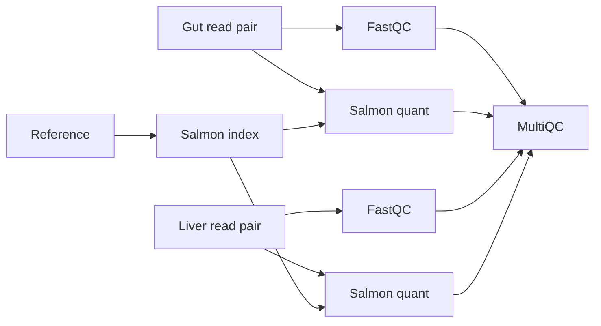

# RNA-seq containers: Nextflow → Necroflow

This experiment runs Necroflow as a normal host Python program. Each scientific
RuleCall launches a separate Docker container. Nextflow runs the same small
RNA-seq workflow and inputs for comparison. No Necroflow core changes are needed.
The repository's main Makefile is unchanged.

## Run

Requirements: Linux amd64, a working local Docker daemon accessible to your user,
Java 17+, GNU Make, and the repository Python environment (`make venv` from the
repository root; tested with Python 3.14). Bioinformatics tools are container-only.
The host Python code uses the standard library plus installed Necroflow.

From the repository root:

```bash
make -C experiments/rnaseq_containers compare
make -C experiments/rnaseq_containers test
make -C experiments/rnaseq_containers integration
```

Or enter this directory and use `make compare`. Override `PYTHON` with an absolute
interpreter path if necessary. After preparation, `../../.venv/bin/python run.py`
runs Necroflow directly, outside containers.

| Target | Purpose |
|---|---|
| `download` | Verify/download pinned upstream archive, extract local source/data |
| `preprocess` | Select first `READ_PAIRS=1000` complete read pairs per sample |
| `setup` | Download pinned Nextflow distribution; pull and verify tool images |
| `necroflow` | Prepare dependencies and run host Python pipeline |
| `nextflow` | Prepare dependencies and run upstream workflow with `-resume` |
| `compare` | Run both engines and compare scientific outputs |
| `test` | Offline regression tests; no Docker or downloads |
| `integration` | Comparison plus real resume, input-edit, Docker failure checks |

For a different subset:

```bash
make -C experiments/rnaseq_containers compare READ_PAIRS=2000
```

Valid counts: 1–2937. Very small counts may be insufficient for Salmon; the validated
default is 1000. Changing the count regenerates the subset; repeating preparation
with unchanged inputs leaves file bytes and mtimes untouched. Malformed records,
mismatched mate IDs, and insufficient pairs fail without replacing a valid subset.
Run one preparation/integration invocation at a time within a checkout.

## Workflow and architecture



`pipeline.py` contains typed rules and ordinary Python sample discovery, loops,
validation, and result selection. Six scientific tasks share three images:
FastQC 0.12.1, Salmon 1.10.3, and MultiQC 1.27.1. Six additional lightweight host
rules expose reference, four read files, and report configuration as symlinks.
`run.py` imports the definitions under a stable module name before execution.

`containers.py` supplies the existing `rule_call_runner` hook. Rules carrying an
`image` config value run in Docker; host input rules use `RuleCall.run`. The runner
uses explicit argv, host UID/GID, no task network, one CPU and 2 GiB per container.
The scheduler allows two tasks / 4 GiB total. The experiment tree is mounted at
its original absolute path read-only, with only the current task directory mounted
writable. This also makes input symlink targets visible. Each container gets a
writable temporary HOME; logs go to the RuleCall's `.rip/job.log`.

Each scientific rule receives its digest-pinned image through normal config, so
image identity enters the existing provenance hash. Changing a tool digest changes
that tool's call identity and downstream lineage. No mutable tags are executed.
`CONTAINER_POLICY` is also hashed: bump it when changing runner execution semantics.
This is explicit experiment policy, not automatic framework-wide environment hashing.

FastQC input filenames and MultiQC staging names match upstream names. MultiQC
uses `--force` to permit reruns at Necroflow's stable workdir and scans only current
staged inputs. Source and node paths remain absolute; moving the checkout changes
input-path provenance. No cluster backend, remote Docker daemon, or Apptainer support
is implemented. Cancellation/container cleanup under host interruption is untested.

## Baseline and data provenance

Baseline: [nextflow-io/rnaseq-nf](https://github.com/nextflow-io/rnaseq-nf/tree/5c89d3859abbe54893d4e1ae0f21115dcebd9d1d),
revision `5c89d3859abbe54893d4e1ae0f21115dcebd9d1d`, Apache-2.0 upstream license.
Its workflow/modules are downloaded unchanged. Generated Nextflow config selects
our per-tool images, resource limits, trace, and result paths. Nextflow 25.10.0 and
upstream archive SHA-256 checksums live in `sources.json`; image digests/build tags
live in `images.json`. Setup verifies actual container tool versions and architecture.

The upstream fixture has 2937 pairs per named sample and a 173,911-byte reference
containing one sequence. Gut and liver fixture reads are byte-identical: these are
two workflow branches, not independent biological replicates. The default subset
retains 1000 pairs from each and leaves the already tiny reference intact.
`data/short/manifest.json` records source and subset hashes.

Downloads: 1,685,274-byte upstream archive plus 38,677,183-byte Nextflow distribution.
Docker reports uncompressed sizes of 613,696,265 bytes (FastQC), 329,709,904 bytes
(Salmon), and 888,282,603 bytes (MultiQC), about 1.83 GB summed before layer sharing.
Image download transfer sizes differ from these local sizes.

## Results and validation

Outputs:

- `results/necroflow/`: copied per-sample QC/quantification and `multiqc/multiqc_report.html`.
- `results/nextflow/`: upstream published outputs and `multiqc_report.html`.
- `reports/`: execution timing, image versions/sizes, Nextflow trace, comparison and
  integration JSON. Reports are regenerated locally and ignored by Git.
- `work/`: both engines' caches and task logs; retain it for resume.

Comparison checks exact transcript IDs/lengths, Salmon numeric fields using
`rtol=1e-4`, `atol=1e-6`, exact FastQC report metrics, and MultiQC coverage of four
read files and two quantifications. It ignores HTML/archive bytes, timestamps,
absolute paths, and branding. MultiQC machine-readable baseline data is read from
its task workdir because upstream publishes only HTML.

Observed on this laptop, 2026-09-16: both workflows completed; Salmon tables matched,
FastQC metrics were identical, and MultiQC sample/module coverage matched. A warm-image
Necroflow cold execution took 10.56 seconds during development; this is an observation,
not a controlled engine performance benchmark. An unchanged Necroflow rerun took 0.16 seconds with all 12 calls cached.
Current timings are in `reports/`.

The integration target verifies both engines resume without scientific work, edits
one gut read's quality byte to check selective reruns, then restores the input and
Necroflow results. It also exercises actual Docker execution in paths containing
spaces, host-owned outputs, exit code 7, and exit 0 with a missing declared output.
Offline tests verify selective image-digest provenance changes without pulling an
alternate image. No alternate scientific image comparison is claimed.

Two implementation findings matter when adapting other pipelines:

1. Import rule definitions under the same module name for every entrypoint.
   Defining them as `__main__` versus importing changes typed rule identity.
2. The current built-in symlink helper has an unquoted `realpath` substitution.
   This experiment uses explicit quoted absolute-path symlink commands so paths
   containing spaces work, without changing core code.

The fixture establishes local container orchestration, caching, and output parity.
It does not establish biological validity, production-scale RNA-seq performance,
or full Nextflow executor parity. Host interpreter/Necroflow versions are supplied
by the repository environment, rather than independently locked by this experiment.

All downloaded data, source archives, tools, workdirs, outputs, and generated reports
are excluded through the experiment's `.gitignore`. Only implementation, pins,
tests, and these findings belong in version control.
